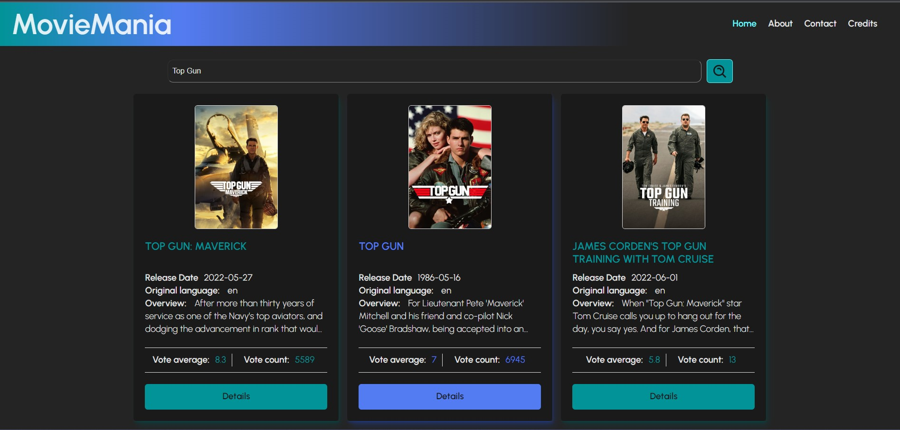

## Movie Mania <!-- omit in toc -->



## Table of Content <!-- omit in toc -->

- [About](#about)
- [Features](#features)
- [Tech used](#tech-used)
- [How to use](#how-to-use)
- [Contributing](#contributing)
- [Credits](#credits)
- [License](#license)

## About

**MovieMania** is a <a href='https://www.themoviedb.org/'> Themoviedb</a> movie Database!
"Millions of movies to discover..."

## Features

Vite React App using movie search function, with poster and video display

Fully responsive

- _mobile and desktop devices friendly_

Main implemented features

- sticky navigation bar
- search component
- poster and video modal components
- simple fluid transitions
- contact form linked to EmailJS
- Light or dark theme according to user preferred color scheme

Use of

- **Vite React** [Vite](https://vitejs.dev/)
- **Themoviedb** [API](https://www.themoviedb.org/documentation/api)
- **Unit tests** [Vitest](https://vitest.dev/) + [React Testing Library](https://testing-library.com/docs/)
- **End to end tests** [Cypress](https://www.cypress.io/)

## Tech used

- **Languages** HTML5 - CSS3 - JSX React
- **Code editor** [VSCode](https://code.visualstudio.com/)
- **Version control** [Git](https://git-scm.com/)
- **Markdown** --> my VSCode [Markdown All in One](https://marketplace.visualstudio.com/items?itemName=yzhang.markdown-all-in-one) extension
- **CI/CD** --> Github actions

## How to use

Open **[MovieMania](https://movie-mania-beryl.vercel.app/)** in your favorite browser

Enter a movie title in the search bar

Click on the poster of your choice to enlarge it

Click outside to come back to the main page

Click on the Details button to see the available information including some Youtube trailers and videos for the most famous

Click on a video to watch it if available

Navigate to About and Contact pages to get more information about the developer

## Contributing

Pull requests are welcome

1. fork this repository

   ```
   git clone https://github.com/Catevika/React_movie-mania.git
   ```

2. change your working directory

   ```
   cd <your working directory>
   ```

3. create your feature branch
   ```
   git checkout -b <your new feature name>
   ```
4. to start working on the created branch
   ```
   npm install
   npm run dev
   ```
5. commit your changes
   ```
   git commit -am 'Add some new feature'
   ```
6. Push to the branch
   ```
   git push origin <your new feature name>
   ```
7. create a new Pull Request with a simple description

Do not hesitate to ask questions, send issues or report bugs if any

Do not forget to ⭐ this project if you like it. Thank you!

## Credits

- **[themoviedb](https://www.themoviedb.org/)**

## License

[MIT](https://choosealicense.com/licenses/mit/) &copy; [Dominique Bello](https://twitter.com/dominique_bello) aka Catevika
